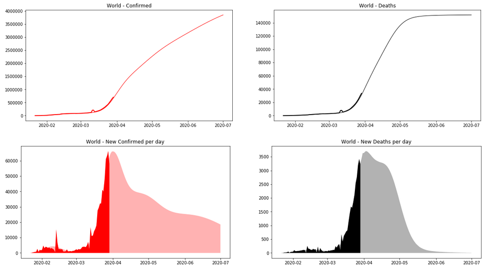
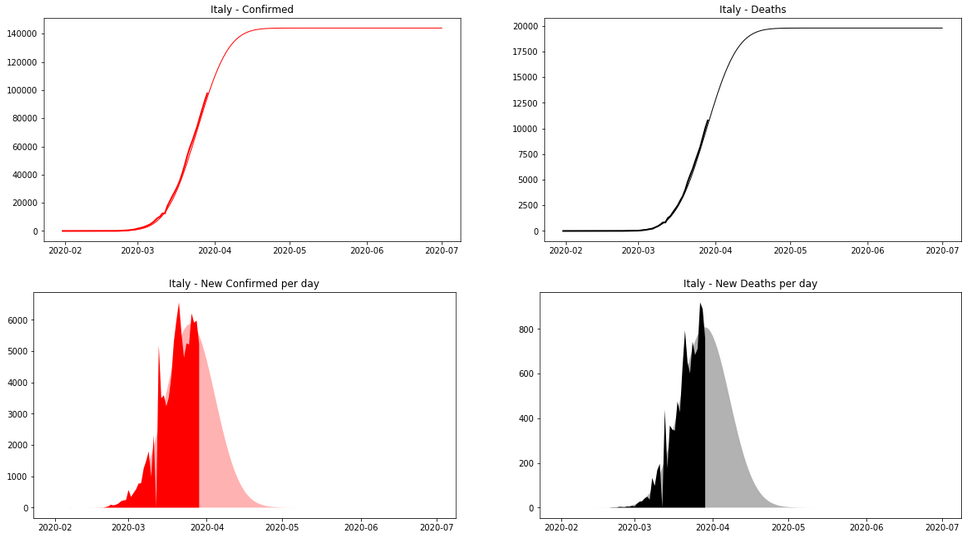
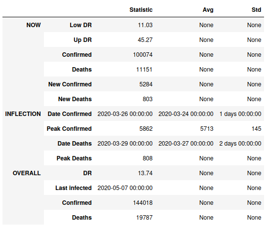

# COVID-19 Prediction


Here is a notebook aiming to predict the number of people infected by the COVID-19 pandemic worldwide, continent-wise and country-wise.

## Prerequesites

* `pandas`
* `matplotlib`
* `numpy`
* `scipy`
* `tqdm`
* `lmfit`

You can install all of them using `pip` or `conda`.

## Utilisation

Clone the repository using
```
git clone https://github.com/abardou/covid19.git
```
then launch the notebook with your favorite program. The data will be retrieved on GitHub, the modelisation will be launched and some reports at different scales will appear.

### Settings

The prediction interval can be adjusted by setting the variable `report_date` in the second cell of the notebook.

The values taken into account for graphs and statistics can also be modified by setting the list `categories` in the same cell. It can be filled with `Confirmed`, `Deaths` and `Recovered`.

### Reports

To print a report, please use the following commands in dedicated cells of the notebook.

#### Worldwide
```python
world_report()
```


#### Continent-wise
Works with Europe, North America, South America, Africa, Asia and Oceania.
```python
continent_report('Continent Name')
```


#### Country-wise
Works with all the infected countries.
```python
country_report('Country Name')
```


#### Statistics



The `*_report` functions also provide some dates and numbers about key properties of the predictions, like figures for the current day, or a date for the peak of new infections.

## Data

The data come from this GitHub repository : https://github.com/CSSEGISandData/COVID-19.

It is filled every day by the Johns Hopkins University CSSE.

It contains, amongst other things, `csv` files with daily report on the number of infected, dead and recovered for countries all around the world. They are the source we used to make our predictions.